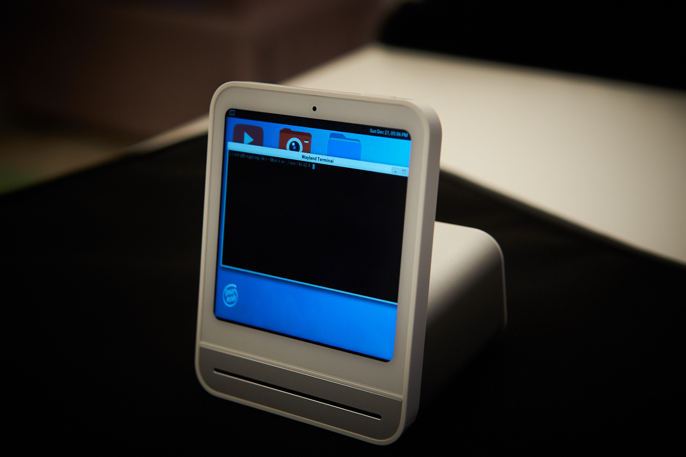
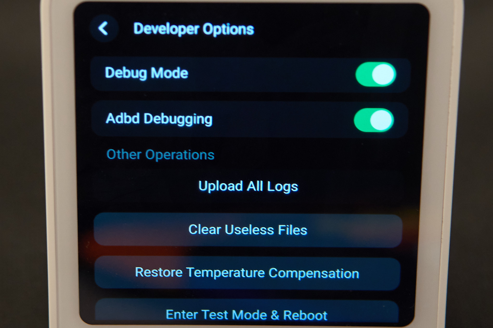
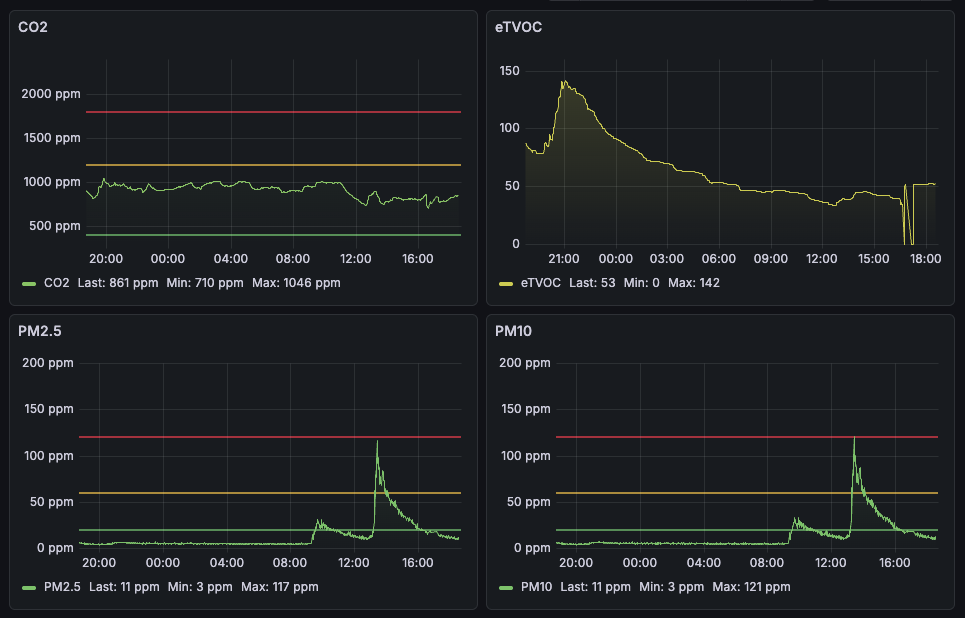
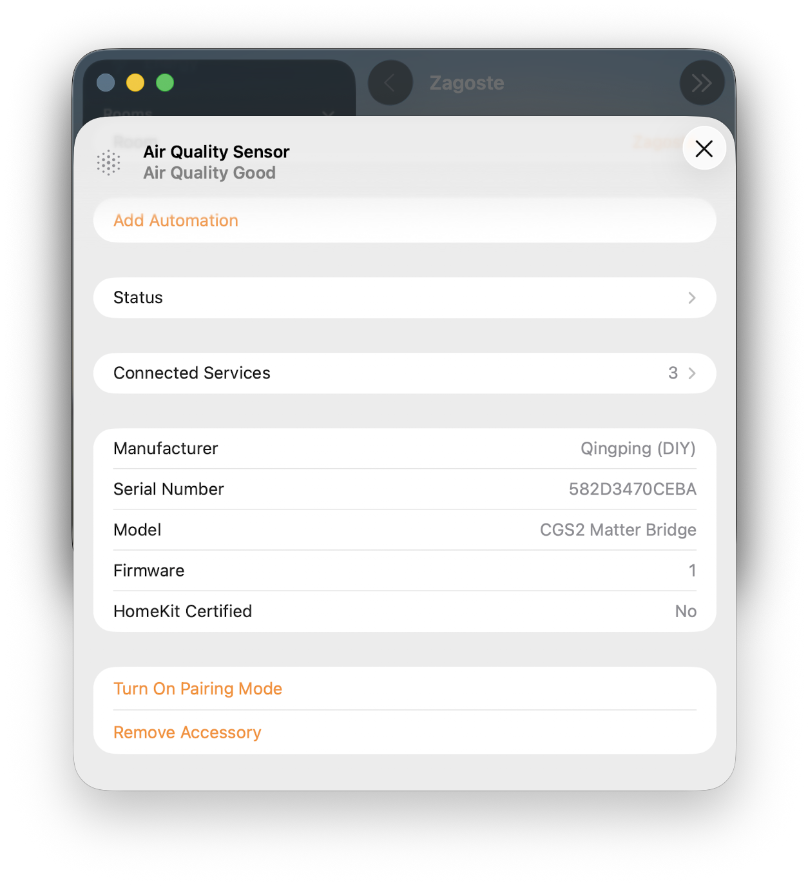

# QingPing CGS2 De-cloud - making an air quality monitor ours


QingPing Air Quality Monitor Gen 2 (also known as CGS2) is a rather stylish little air quality monitor. It has all the nice sensors you might want (CO2, PM2.5, PM10 , temperature, humidity) and then some (noise, eTVOC...). It's all packaged in a nice looking device, with a colour touch screen, built in battery and WiFi. In this short writeup, we'll untether it from the cloud and make it report the data to us. 





WiFi you say? Is that safe? Wonder what it would do if we connect it to the Internet... Actually, I'd rather not find out, so I did a little bit of digging and figured out how to get a root shell on the device, change the settings and get it to talk to my MQTT server directly without sending a single packet out of my local network. 

There is an existing way to get this device to log data to your custom MQTT server, but you have to first create account and ask the manufacturer nicely. Doing it yourself, as outlined in this guide, is simpler, IMHO. QingPing were nice enough to make things easy for us and this didn't require as much reverse engineering as some of my other projects. 

So, if you got one of these for Christmas, do not connect it to the internet, but follow along as we explore the inner workings of the device and get it to talk to us instead of QingPing cloud. 

Note: Robert Ying already did an awesome job finding a firmware update vulnerability that could serve as an alternative way of getting a shell. Read about it [here](https://robertying.com/post/qingping-cgs1-home-assistant/). 

# Getting a shell

As far as interfaces go, we have a touch screen and a USB-C port. Connecting to the USB port only begins to charge the device, it doesn't enumerate as anything. 

A little bit of digging reveals that his device actually/sort of runs Android, which makes sense. A little bit more digging through the firmware and the main application (`QingSnow2App`) shows a few hints that the old "developer mode" Android trick might work on this device, too. Go to `Settings->About` and press 7 times on the `Device Name` line. 

This gets you into the `Developer options` menu. Scroll all the way down and you'll see a way to enable `debug mode` and `adb shell`. 




As easy as possible. Enable and reboot the device. When you connect the USB-C cable, it will enumerate as QingPing device. Install ADB on your linux machine and start a root shell by running:

```
adb shell
```

This will drop you into a BusyBox shell as root and we can start snooping around. 

## Disabling Internet access

Before we connect the thing to WiFi, let's first implement some preventative measures. Execute the following commands (see comments as to why):

```
# kill watchdog and QingSnow2App so they don't interfere
killall watchdog.sh
killall QingSnow2App

# create sysctl.conf to 
# disable IPv6 
# set IPv4 TTL to 2 so packets can't leave local network
cat << EOF > /etc/sysctl.conf 
net.ipv6.conf.all.disable_ipv6 = 1
net.ipv6.conf.default.disable_ipv6 = 1
net.ipv6.conf.lo.disable_ipv6 = 1
net.ipv4.ip_default_ttl=2
EOF

# execute sysctl on startup
cat << EOF > /etc/init.d/S52custom
/sbin/sysctl -p /etc/sysctl.conf
EOF

# make custom init.d executable, so network gets disabled on startup
chmod +x /etc/init.d/S52custom

# DNS entries for QingPing servers, point to your desired server
cat << EOF >> /etc/hosts
192.168.1.121 mqtt.bj.cleargrass.com
192.168.1.121 gateway.cleargrass.com
192.168.1.121 qing.cleargrass.com
192.168.1.121 cn.ots.io.mi.com
192.168.1.121 cn.ot.io.mi.com
EOF

# reboot 
reboot
```

Most important part above is preventing the device from talking to the Internet. After that is done, reboot and connect the device to WiFi. I'd still put it on a dedicated IoT network and isolate it in the firewall, but that depends on your network config. 

## SSH access

After you've done the above and the device connects to the WiFi, you can access it via `ssh`. 
Root login is permitted, and the password is `rockchip`:
```
 $ ssh root@192.168.1.189

root@192.168.1.189's password:
[root@Qingping-Air-Monitor:~]#
```

We can ditch the `adb` shell. 

# Custom MQTT Settings 

If you dig around the system, you'll quickly figure out how things work. Long story short, there's a `settings.ini` file in `/data/etc/` that contains settings for the QingSnow2App. You'll probably want to edit those (kill the watchdog and QingSnow2App as before before changing it) to include something like:

```
# address of your MQTT server, data sampling interval and reporting interval
[192.168.1.121]
save_history_interval=60
sync_history_interval=300

# more details for the MQTT server, adjust as needed, these were copied from default
[host]
client_id="582D340067EC|securemode=3,signmethod=hmacsha256,prefix=|"
host=192.168.1.121
password=7e75d418b1d0fa.........
port=1886
pub_topic=Snow/up/XXXD347XXXXA
sub_topic=Snow/down/XXXD347XXXXA
tls=0
username=XXXD347XXXXA&zTyDaFEOg

# not strictly neccessarry
[location]
city_id=n000000
city_name_sc=
city_name_tc=
city_name_us="MoonBase"
country=
is_auto=true

```

You can do some of the above from the developer menu as well. 


# Weather data

One nice feature of this device is that it can query the cloud to retrieve weather data for your location. It will first figure out your location based on your public IP address , then fetch weather details. I've included a simple python server that mimics what the cloud side does:

```python
    def do_GET(self):
        """Handle GET requests."""
        global weather_data,location_data
        if self.path == '/daily/locate':
            payload = '{"data":'+location_data + ',"code":0}'
            self._send_json(payload)
            return
        elif self.path.startswith("/daily/weatherNow"):
            payload = '{"code" : 0,"data" : ' + weather_data + '}'
            print(payload)
            self._send_json(payload)
            return
        elif self.path.startswith("/device/pairStatus"):
            payload = """
            {"desc":"ok","code":10503}
            """
            self._send_json(payload)
            return
        elif self.path.startswith("/cooperation/companies?lang=en_US"):
            payload = """
            {"data":{"cooperation":["private"]},"code":1}
            """
            self._send_json(payload)
            return
        elif self.path.startswith("/firmware/checkUpdate"):
            payload = """{"data":{"upgrade_sign": 0 } , "code" : 0 }"""
            return

```

The rest of the code fetches current weather data from NWS. If you are outside the US, you'd need different code. 

The weather server also serves a couple of other URL endpoints that the device seems to expect. I just serve it the default data for now though there could be other useful features to implement. 

Before deploying this in a container, be sure to update the `LAT` and `LONG` for your location.

# Setting up the logging 

NOTE: Before you deploy this, make sure to change all the secrets in `docker-compose.yaml` and in various other config files. These are default values taken from the source repo and I don't want you to get owned if your server ends up online. 


The whole reason for doing this is that I wanted to log measurements over time. The following setup is a complete overkill, but it's so easy to set up with containers that I couldn't resist.

We'll use mosquitto as an MQTT server to receive updates from the device, Telegraf to stream those updates into an InfluxDB which will be queried and displayed by Grafana. The trickiest bit here was to figure out the Telegraf config, all the rest is simple. You'll need to adjust it for your device as it will likely have a different ID:

```
[[inputs.mqtt_consumer]]
  servers = ["tcp://mosquitto:1883"]
  topics = [
    "Snow/up/582D3470CEBA"
  ]
  data_format = "json_v2"


  [[inputs.mqtt_consumer.json_v2]]
  name_override = "air_quality_batch"
  measurement_name = "air_quality_batch"
    [[inputs.mqtt_consumer.json_v2.object]]
        path = "sensorData"
        timestamp_key = "timestamp_value"
        timestamp_format = "unix"
```

Use `docker-compose` to start up all the containers on your server. Make sure the device is configured to use the correct IP address everywhere (in `/etc/hosts` and in `settings.ini`), reboot the device and it should start reporting. 




Note: sometimes the QingSnow2App start up before the WiFi connects, in which case it might not find the MQTT server which causes an error. It will still report the data, but intermittently. I should introduce a delay somewhere to account for this. 


# Matter over WiFi

Once you have a root shell, you can also make the CGS2 a **native Matter Air
Quality Sensor** so its readings show up in Apple Home, Home Assistant, Google... Over WiFi only , no Bluetooth.

The device is a Rockchip PX30 (aarch64) running Buildroot / glibc 2.29, and it
turns out stock **Node.js 20** runs on it unmodified. So instead of
cross-compiling the C++ Matter SDK we run [matter.js](https://github.com/matter-js/matter.js):
a ~90 MB Node process that tails QingSnow2App's SQLite history DB
(`/data/etc/Snow2.db`, read-only) and mirrors the latest CO2 / PM2.5 / PM10 /
temperature / humidity / TVOC values into a Matter `AirQualitySensor` endpoint.
QingSnow2App and the MQTT logging above keep running untouched.

Apple Home always wants **BLE for the first commissioning**, which this device
can't do. But we can trick it. Commission it on-network once with the little `qp-ctl`
controller (in `tools/`), then open a commissioning window and add it to Apple Home
as a *second* admin - that join goes over IP, no BLE required.

**Start here:** [`DEPLOY.md`](DEPLOY.md) - a copy-paste, end-to-end guide from a
freshly de-clouded device (including setting up SSH keys) to sensors in Apple
Home. Component-level references: [`matter/README.md`](matter/README.md) (the
bridge) and [`tools/README.md`](tools/README.md) (commissioning / Apple Home).

  

# References

 - [Robert Ying's writeup](https://robertying.com/post/qingping-cgs1-home-assistant/)
 - [Docker-compose starting repo](https://github.com/Miceuz/docker-compose-mosquitto-influxdb-telegraf-grafana)
 - [matter.js](https://github.com/matter-js/matter.js)

# Other notes

There's a few extra things that would be nice. 

First: a python interpreter on the device - easy to do with a chroot of prebuilt arm64 binaries. I need to document this. 

Second: run Doom  - just for laughs. The device is easily capable of running GL , so we might even get Q3! In order to run custom GUI apps, you need to start weston:

```
cd usr/bin
mkdir -p /tmp/.xdg &&  chmod 0700 /tmp/.xdg
export XDG_RUNTIME_DIR=/tmp/.xdg
weston --tty=2 --idle-time=0&

```
You can find some default QT UI apps in `/usr/libexec`. 

Third: if only there was a browser! It'd make it easy to make custom UI. Sadly, the built-in QT suite doesn't have webkit. We could modify the main binary to use custom QML but...


Peace on Earth, 
ea


